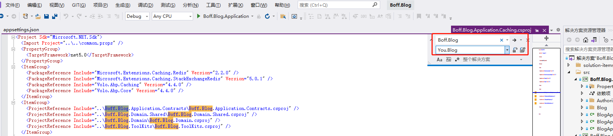
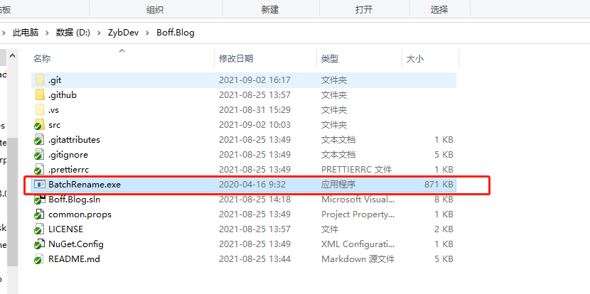
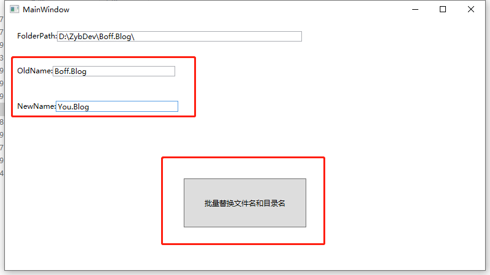

# Boff.TempleteProjectBatchRename

示例代码项目的快速重命名工具,可批量替换文件夹名称和文件名称为新项目的名称  
Sample code project fast renaming tool, can batch replace folder name and file name to the name of the new project

Usage

1:使用 visual studio 批量替换(ctrl+f),替换所有代码中的原项目名称为新项目名称  
Using visual studio batch replacement (CTRL + f), to replace the original project name in all the code name for the new project

2.保存代码后关闭visual studio,复制BatchRename.exe到项目文件夹根目录  
Save the code and close visual studio, copy BatchRename.exe to the root directory of project folder 

3.运行BatchRename.exe,输入原项目名称和新项目名称,点击按钮,替换文件夹名称和文件名称  
Run BatchRename.exe, enter the name of project and the new project name, click on the button, replace the folder name and file name

